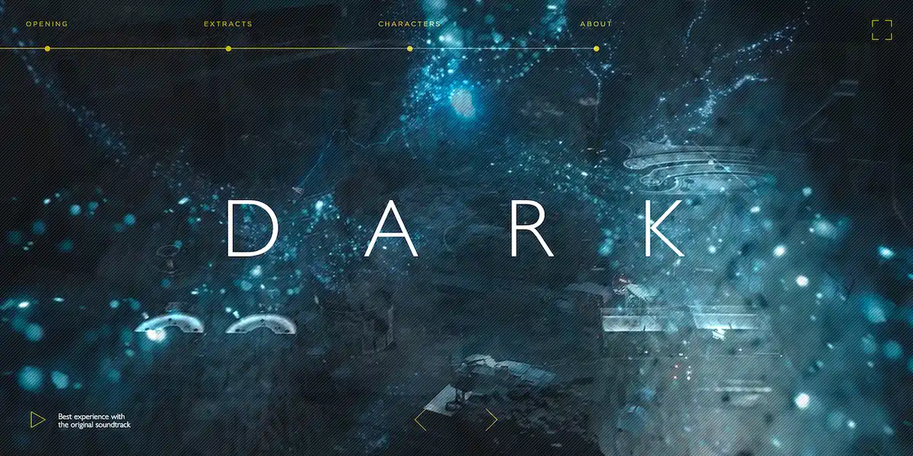

This repository is a showcase for my personal following Javascript libraries:

*   [ScrollBtween.js](https://github.com/olivier3lanc/Scroll-Btween) Tween any CSS values on any DOM element in relation with its position into the viewport.
*   [ScrollFrames.js](https://github.com/olivier3lanc/Scroll-Frames) Animate sequences of still frames on any DOM element in relation with its position into the viewport.

# D A R K HTML5 cinematics

Web cinematics inspired from [D A R K](https://www.netflix.com/fr/title/80100172) serie opening credits. **[Launch](https://olivier3lanc.github.io/folio-dark)**

## Songs
    
*   [Apparat - Goodbye](https://www.apparat.net)
*   [Apparat - Joel](https://www.apparat.net)
*   [Teho Teardo & Blixa Bargeld - A Quiet Life](http://www.tehoteardo.com/en/opera/album/teho-teardo-blixa-bargeld/)
*   [Fever Ray - Keep the Streets Empty for Me](https://feverray.com/)
*   [Agnes Obel - Familiar](https://www.agnesobel.com/)
*   [Chris Avantgarde feat. Red Rosamond - Inside](https://soundcloud.com/chrisavantgarde/chris-avantgarde-feat-red-rosamond-inside)
*   [May The Muse and Robot Koch - Bad Kingdom](https://www.youtube.com/watch?v=FMemllFAw2o)
*   [Hozier - In The Woods Somewhere](https://www.youtube.com/watch?v=XlfCfEfbO48)
*   [Bloc Party - The Pioneers (M83 Remix)](https://www.youtube.com/watch?v=K-esZZBKp1c)
*   [Peter Gabriel - My Body Is A Cage](https://www.youtube.com/watch?v=PkNtBuwWq_o)
*   [Raury - God's Whisper](https://www.youtube.com/watch?v=Bh1XRH4HrOY)
*   [RY X - Thunder](https://www.youtube.com/watch?v=Nx-bsD8DgZM)

## Fonts
    
*   [Gotham Light](https://www.typography.com/fonts/gotham/styles)
*   [Gill Sans Nova Light](https://www.linotype.com/fr/1603102/gill-sans-nova-light-product.html)

## Javascript

*   [Ola.js](https://github.com/franciscop/ola) Smooth animation library for interpolating numbers 
*   [ScrollBtween.js](https://github.com/olivier3lanc/Scroll-Btween) Tween any CSS values on any DOM element in relation with its position into the viewport.
*   [ScrollFrames.js](https://github.com/olivier3lanc/Scroll-Frames) Animate sequences of still frames on any DOM element in relation with its position into the viewport.

## Stylesheets
    
*   BRIKS - Personal framework
*   CSS video frames - Personal framework
*   [Normalize.css](https://necolas.github.io/normalize.css/)

## Making of

All embedded texts were removed from frames - using masks and timeline - and extracted with high quality in [Adobe Photoshop](https://www.adobe.com/fr/products/photoshop.html).

All series of frames were highly compressed in [webp format](https://en.wikipedia.org/wiki/WebP).
